# Telegram4KaiOS

Unofficial Telegram client for KaiOS.

### Made with

- [mtcute](https://github.com/mtcute/mtcute) (amazing mtproto library)
- solid.js
- 👀🙌🤖

## Screenshots

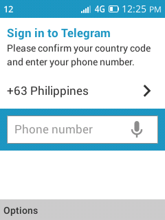
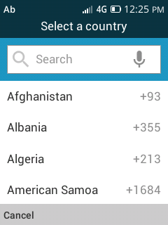
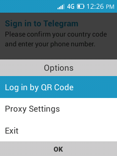
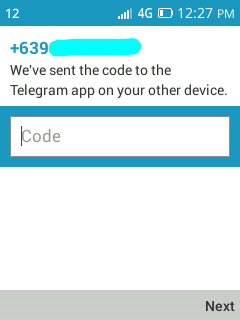
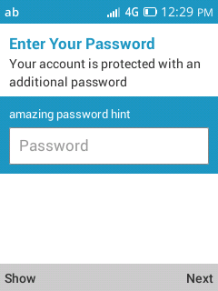
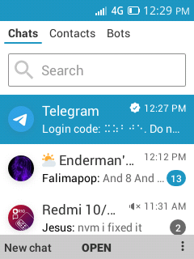
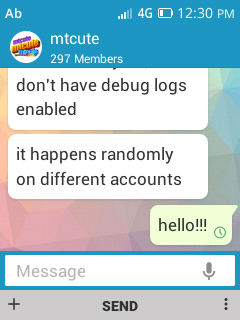
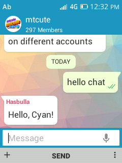
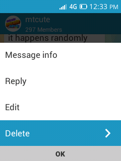
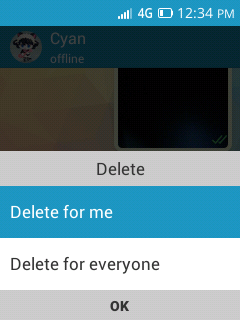
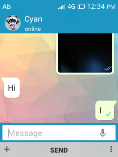
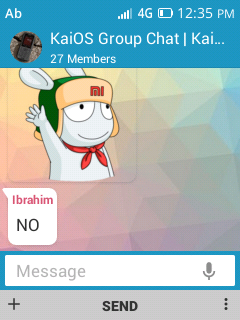
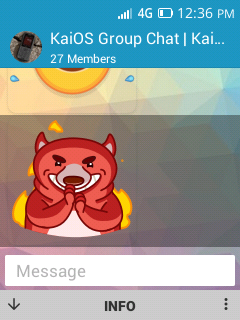
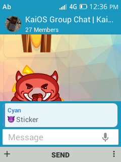
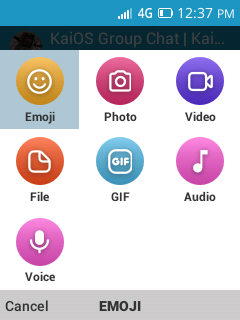
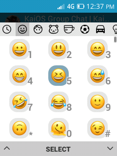

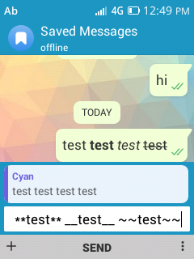
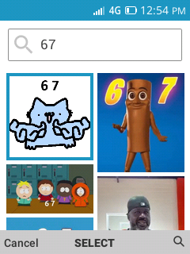
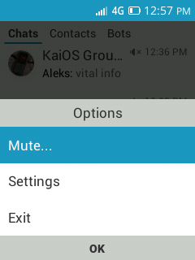
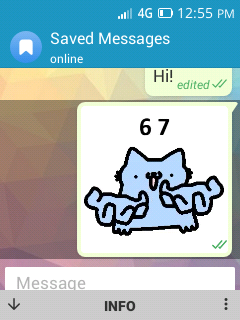
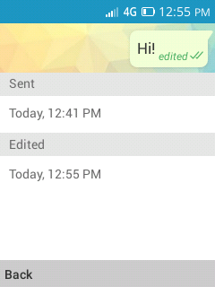
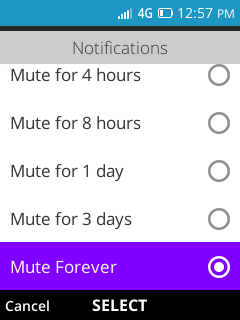
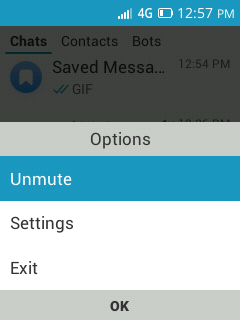
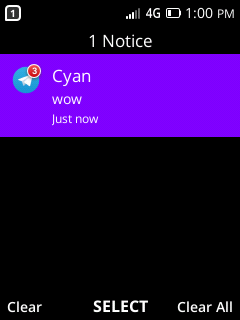
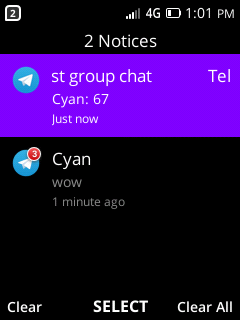
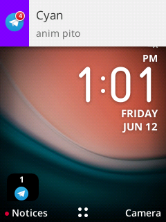
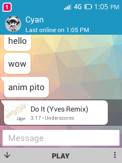


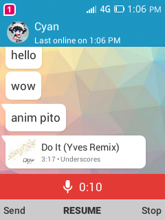
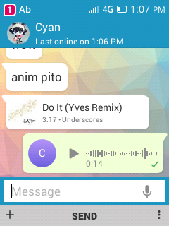
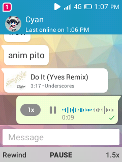
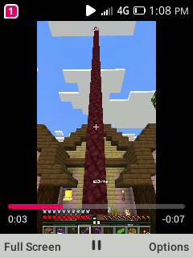
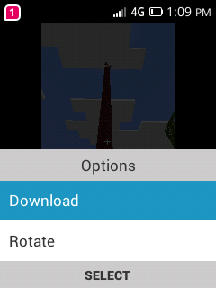

## Developing

### Prerequisites

Install the latest **LTS version of Node.js** and **Bun**:

- Node.js (Latest LTS)
- Bun: https://bun.sh/

### Environment Setup

Create a `.env.local` file and copy the contents of `.env` into it.

Replace the following values with your own Telegram API credentials:

```env
APP_ID=your_app_id
APP_HASH=your_app_hash
```

### Development

> [!NOTE]  
> **Bun is required.** npm, pnpm, and yarn are not supported.

#### KaiOS 2.5

```bash
bun run dev
```

#### KaiOS 3.0

```bash
bun run dev:v3
```

#### KaiOS 4.0

```bash
bun run dev:v4
```

### Building for Production

#### KaiOS 2.5

```bash
bun run build
```

#### KaiOS 3.0

```bash
bun run build:v3
```

#### KaiOS 4.0

```bash
bun run build:v4
```

#### CloudPhone

```bash
bun run build:cloudphhone
```

> [!NOTE]  
> CloudPhone support is highly experimental and only works on QVGA devices.
> `https://telekram.netlify.app/#cloudphone=1&api_id=<INSERT YOUR APP ID HERE>&api_hash=<INSERT YOUR APP HASH HERE>`

### Deployment

After the build completes, the generated files will be available in their respective directories:

- **KaiOS 2.5:** `dist`
- **KaiOS 3.0:** `dist-v3`
- **KaiOS 4.0:** `dist-v4`
- **CloudPhone:** `dist-v3`

## GIVE ME MONEY

[](https://ko-fi.com/H2H7LIPNW)

mtcute developer: https://tei.su/donate

## Discord Server

for updates and to join the app testers.

[](https://discord.gg/W9DF2q3Vv2)

testers will be able to install the app directly from the KaiStore.
